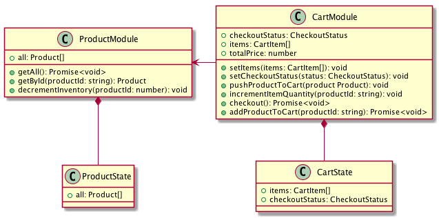

TypeScript で Vuex を書いてみる
===

###### Created by Masaaki Hojo ( [@masterpg](https://github.com/masterpg) )

---

# Vuex の必要性

ある規模のアプリケーションになると、アプリケーションで扱うデータを管理する必要性が生じます。

Vuex はこのようなアプリケーションのデータ管理をするためのライブラリになります。

---

## データ管理を行う必要性について

今後 SPA でアプリケーションを作成する機会が増えていくと考えられます。

SPA では API でサーバーから取得したデータをクライアントサイドに保管し、そのデータを各画面で共有するケースが多々あります。

もし各画面で共有するデータを管理せず、その場しのぎで実装していくと間違いなくスパゲッティコード化していきます。

---

## データ管理をしないアプリケーションの問題点

* 同じようなデータがいたるところに存在する
* データ更新ロジックがいたるところに存在するため、どれを使ったらよいか分からない
* 取得されたデータの出どころが分からないため、意図しないタイミングでデータが更新されてしまうことがある

---

## データ管理ライブラリを使いましょう

Vuex のようなデータ管理ライブラリを使用することで、データが中央集権的に管理され、適切なデータの取得、編集を行うことができるようになります。

---

# Vuex で重要な単語

Vuex には重要な単語がいくつかありますが、最初はこの単語の意味を理解するのが大変です。

重要な単語とその役割について簡単に説明します。

---

## ストア

ストアはアプリケーションのデータを管理するコンテナで、以降で説明するすべての単語を内包する親玉みたいな存在です。

---

## モジュール

モジュールは以降で説明する`ステート`、`ゲッター`、`ミューテーション`、`アクション`を管理するコンテナです。

---

## ステート

ステートは意味のあるデータの塊です。モジュールはこのデータの塊を大事に管理します。

---

## ゲッター

ゲッターはステートからデータを取り出し、利用者が扱いやすようデータを加工して提供します。

---

## ミューテーション

ミューテーションはステートを編集をするための機能を提供します。

---

## アクション

アクションは非同期なデータの取得、編集機能を提供します。

例えば REST API のように非同期でデータを取得、編集するような場合が対象となります。

アクションはステートを編集できません。このためステートを編集するにはミューテーションに依頼します。

---

## データモデルを設計する

サンプルとしてショッピングカートのデータモデル設計を行いました。

モデル設計した結果、`ProductModule`と`CartModule`という 2 つのモジュールが作成されました。

---

### Vuex の単語とひも付ける

